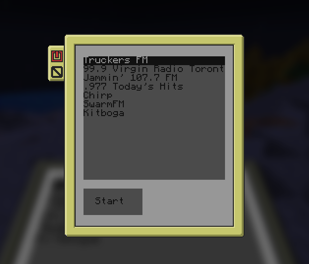

# Internet Radio 2 Computercraft


This repository contains a C# program that utilizes `ffmpeg` to stream audio to `Computercraft:Tweaked`. It supports direct audio streams in most formats, YouTube, Twitch, and many other sites.

## Contents

- **C# Program**: Streams audio to Computercraft:Tweaked using `ffmpeg`.
- **LUA Script**: To be installed on a CC:T computer.
- **Setup Instructions**: Detailed steps to set up the project (see `Setup.md`).

## Features

- Supports a wide range of audio formats.
- Compatible with YouTube, Twitch, and many other streaming sites.
- Real-time audio streaming.

## Prerequisites

- `yt-dlp`
- `ffmpeg`
- .NET 9

## Setup

1. **Install Dependencies**:
    - Ensure `yt-dlp` and `ffmpeg` are installed and available in your system's PATH.
    - Install the .NET SDK from your distro's repos, but if it's not available, [here](https://dotnet.microsoft.com/download).

2. **Clone the Repository**:
    ```sh
    git clone https://github.com/yourusername/InternetRadio2Computercraft.git
    cd InternetRadio2Computercraft
    ```

3. **Build the C# Program**:
    ```sh
    dotnet build
    ```

4. **Run the Program**:
    ```sh
    dotnet run --project InternetRadio2Computercraft
    ```

5. **Install the LUA Script**:
    - Drag and drop the appropriate `radio.lua` file to your CC:T computer. 
      - _deskto.lua for desktop computers
      - _tablet.lua for noisy tablets
      
## Usage

1. **Start the Server**:
    - Run the C# program to start the HTTP server.
    - The server listens on port 2468/TCP by default.

2. **Connect via WebSocket**:
    - Use a WebSocket client to connect to `ws://<your-server-ip>:2468/`.
    - Send the URL of the audio stream you want to play.

3. **Enjoy the Stream**:
    - The audio stream will be processed and sent to your CC:T computer.

## Troubleshooting

- **Dependencies Not Found**:
    - Ensure `yt-dlp` and `ffmpeg` are installed and accessible in your system's PATH.

- **WebSocket Connection Issues**:
    - Verify the server is running and accessible on the correct port.
    - Check for any network issues or firewall settings blocking the connection.

## Contributing

Contributions are welcome! Please open an issue or submit a pull request.

## License

This project is licensed under the MIT License. See the `LICENSE` file for details.

## Contact

For any questions or suggestions, feel free to reach out!
